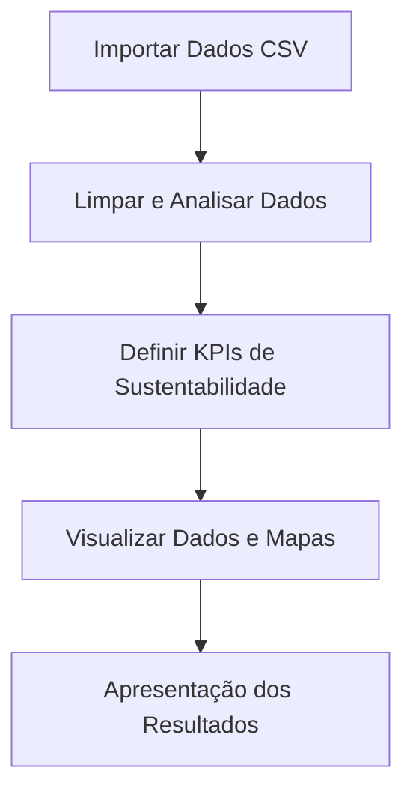

## Testes Automatizados

O projeto possui testes automatizados para backend, scripts de dados e visualização.

Para rodar todos os testes:

```bash
make test
```

Os testes cobrem:

- Backend Flask (rotas principais)
- Banco simulado (db_simulado)
- Limpeza de dados (src/limpeza.py)
- Visualização/gráficos (src/visualizacao.py)
- Geração de mapa (src/mapa.py)

# Mapa de Turismo Acessível

## Descrição do Projeto

O **Mapa de Turismo Acessível** é uma solução inovadora que mapeia atrações e estabelecimentos turísticos com acessibilidade, facilitando o planejamento de viagens para pessoas com deficiência e promovendo o turismo sustentável e inclusivo.

## Divisão de Tarefas — Papéis e Especialistas

Os papéis podem ser acumulados por uma mesma pessoa, conforme a afinidade e interesse do grupo:

### 1. Líder de Projeto / Documentação

- Organizar tarefas, prazos e reuniões.
- Garantir que a documentação esteja clara e atualizada.
- Auxiliar na configuração do ambiente e versionamento (Git).
- Arquivos: `README.md`, `Makefile`, `.gitignore`, `requirements.txt`.

### 2. Especialista em Dados & KPIs

- Importar, limpar e tratar os dados (CSV).
- Definir e calcular KPIs de turismo sustentável.
- Ferramentas: pandas.
- Scripts: `src/limpeza.py`, análise em `notebooks/exploracao.ipynb`.

### 3. Especialista em Visualização

- Criar gráficos, dashboards e mapas de acessibilidade.
- Trabalhar com matplotlib, seaborn e folium.
- Integrar visualizações ao storytelling.
- Scripts: `src/visualizacao.py`.

### 4. Especialista em Desenvolvimento de Mapas

- Implementar o mapa interativo das atrações acessíveis.
- Utilizar folium (ou streamlit para web, se desejado).
- Garantir que o mapa seja fácil de usar e visualmente acessível.
- Scripts: `src/mapa.py`.

### 5. Storytelling e Apresentação

- Preparar slides, roteiro e visualizações para apresentação final.
- Garantir clareza, narrativa e impacto na apresentação dos resultados.

> **Dica:** Todos colaboram na apresentação final e podem revisar o trabalho uns dos outros para garantir qualidade e aprendizado coletivo.

---

## Estrutura Sugerida do Projeto

```
turismo-acessivel/
│
├── data/                # Dados CSV fictícios
│   ├── atracoes.csv
│   ├── visitantes.csv
│   └── reservas.csv
│
├── src/                 # Código-fonte Python
│   ├── limpeza.py
│   ├── visualizacao.py
│   ├── mapa.py
│   └── app.py           # Backend Flask básico
│
├── templates/           # Frontend HTML (Flask)
│   ├── index.html
│   └─ pages/           # Outras páginas HTML
│
│
├── static/
│   ├── styles/          # Arquivos CSS
│   │   └── style.css
│   └── scripts/         # Arquivos JS
│       └── main.js
│
├── notebooks/           # Jupyter Notebooks para exploração
│   └── exploracao.ipynb
│
├── requirements.txt     # Dependências do projeto
├── Makefile             # Automatização de comandos
├── README.md            # Documentação principal
└── .gitignore           # Arquivos a serem ignorados pelo Git
```

---

## Fluxograma Simples



---

## Como Configurar o Projeto

1. **Clone o repositório:**

   ```sh
   git clone <url-do-repo>
   cd turismo-acessivel
   ```

2. **Crie um ambiente virtual:**

   ```sh
   python3 -m venv venv
   source venv/bin/activate
   ```

3. **Instale as dependências:**

   ```sh
   pip install -r requirements.txt
   ```

4. **Rode todo o projeto com Makefile:**

   ```sh
   make all
   ```

   Ou rode scripts individuais:

   ```sh
   make limpeza
   make visualizacao
   make mapa
   ```

5. **Rodar o backend Flask:**

   ```sh
   make run
   ```

   Depois, acesse http://127.0.0.1:5000 no navegador para ver a interface simples.

6. **(Opcional) Rode notebooks no VSCode:**
   - Abra o arquivo `.ipynb` e execute as células.

---

## Tecnologias Sugeridas para Desenvolvimento Básico

**Backend:**

- [Flask](https://flask.palletsprojects.com/) — Framework web Python super simples, fácil de rodar e aprender.
- pandas — Para ler e tratar os dados.

**Frontend:**

- HTML básico com Jinja2 (templates do Flask).
- CSS simples (opcional, já incluso no exemplo).

**Extra:**

- Jupyter Notebook para exploração e análise.

Essas tecnologias são leves, fáceis de instalar e permitem terminar o projeto rapidamente.

Se quiser evoluir depois, pode usar Streamlit, Dash ou bibliotecas JS, mas para o hackathon Flask + HTML já resolve!

---

## Makefile — O que é e como funciona

O `Makefile` automatiza comandos comuns do projeto. Basta rodar `make <alvo>` no terminal. Exemplos de alvos:

- `make all` — Executa todo o pipeline do projeto (limpeza, visualização, mapa).
- `make limpeza` — Executa apenas a limpeza dos dados.
- `make visualizacao` — Gera gráficos e visualizações.
- `make mapa` — Gera o mapa interativo.
- `make install` — Instala as dependências do projeto.

**Exemplo de Makefile:**

```makefile
install:
	pip install -r requirements.txt

limpeza:
	python src/limpeza.py

visualizacao:
	python src/visualizacao.py

mapa:
	python src/mapa.py

all: limpeza visualizacao mapa
```

---

## Comandos Git Úteis

- `git status` — Verificar status dos arquivos.
- `git add .` — Adicionar mudanças.
- `git commit -m "mensagem"` — Salvar mudanças.
- `git push` — Enviar para o repositório remoto.
- `git pull` — Atualizar seu repositório local.

---

## Dicas para Instalar Bibliotecas

- Adicione as bibliotecas usadas no `requirements.txt`:
  ```
  pandas
  matplotlib
  seaborn
  folium
  ```
- Instale todas de uma vez:
  ```sh
  pip install -r requirements.txt
  ```

---

## Exploração de Dados

- Use os arquivos CSV em `data/` para treinar pandas, matplotlib e seaborn.
- Cada equipe pode definir KPIs como: número de atrações acessíveis, reservas por perfil de visitante, impacto ambiental, etc.
- Dicas:
  - Limpe dados nulos ou inconsistentes.
  - Visualize tendências e padrões.
  - Use gráficos para contar histórias.
