# Mapa de Turismo Acessível

## Descrição do Projeto

O **Mapa de Turismo Acessível** é uma solução web que mapeia atrações e estabelecimentos turísticos acessíveis em Angola, facilitando o planejamento de viagens para pessoas com deficiência e promovendo o turismo sustentável e inclusivo.

## Funcionalidades

- Visualização de atrações acessíveis em mapa interativo (Folium)
- Filtros dinâmicos por tipo e acessibilidade
- Busca com autocomplete e centralização do mapa
- KPIs dinâmicos de turismo acessível
- Interface web responsiva com navegação unificada
- Backend robusto com Flask e API para dados
- Testes automatizados para backend, scripts e visualizações

## Estrutura do Projeto

```
MTA/
├── data/                # Dados CSV reais
│   └── atracoes.csv     # Base de dados principal
├── src/                 # Código-fonte Python
│   ├── app.py           # Backend Flask
│   ├── mapa.py          # Geração do mapa e filtros
│   ├── limpeza.py       # Limpeza e tratamento de dados
│   ├── visualizacao.py  # Gráficos e KPIs
│   └── db_simulado.py   # Leitura dos dados
├── templates/           # HTML (Jinja2)
│   ├── index.html
│   └── pages/
│       └── mapa.html
├── static/              # CSS e JS
│   ├── styles/
│   └── scripts/
├── requirements.txt     # Dependências
├── Makefile             # Comandos automatizados
└── README.md            # Documentação principal
```

## Tecnologias e Ferramentas Utilizadas

| Tecnologia/Ferramenta | Uso no Projeto (%) | Descrição                                                            |
| --------------------- | ------------------ | -------------------------------------------------------------------- |
| Python                | 100%               | Linguagem principal de backend, scripts e manipulação de dados       |
| Flask                 | 100%               | Framework web, serve rotas, API e páginas                            |
| pandas                | 100%               | Manipulação, limpeza e leitura dos dados CSV                         |
| folium                | 100%               | Geração do mapa interativo                                           |
| matplotlib            | 50%                | Gráficos e visualizações em scripts e relatórios                     |
| seaborn               | 20%                | Gráficos estatísticos avançados (opcional)                           |
| HTML/Jinja2           | 100%               | Templates de todas as páginas                                        |
| Tailwind CSS          | 100%               | Framework CSS para responsividade e design                           |
| JavaScript            | 100%               | Filtros, busca/autocomplete, interação com o mapa e navegação mobile |
| AOS                   | 60%                | Animações de entrada de elementos                                    |
| Feather Icons         | 60%                | Ícones vetoriais em botões, navbar e filtros                         |
| Makefile              | 100%               | Automatização de comandos de build, run e test                       |

**Todas as bibliotecas listadas em requirements.txt são utilizadas no projeto.**

## Recomendações Finais

- Caso a navbar não apareça igual em todas as telas, limpe o cache do navegador e recarregue as páginas.
- Certifique-se de que todos os arquivos HTML carregam os mesmos scripts JS no final do `<body>`.
- Para dúvidas ou sugestões, abra uma issue no repositório ou entre em contato com a equipe.

## Como Configurar o Projeto

1. **Clone o repositório:**
   ```sh
   git clone <url-do-repo>
   cd MTA
   ```
2. **Crie um ambiente virtual:**
   ```sh
   python3 -m venv venv
   source venv/bin/activate
   ```
3. **Instale as dependências:**
   ```sh
   pip install -r requirements.txt
   ```
4. **Rode o backend Flask:**
   ```sh
   make run
   ```
   Depois, acesse http://127.0.0.1:5000 no navegador.
5. **Rodar os testes:**
   ```sh
   make test
   ```

## Testes Automatizados

O projeto possui testes automatizados para backend, scripts de dados e visualização. Para rodar todos os testes:

```sh
make test
```

## Observações sobre a Navbar

- A navbar foi padronizada para ser idêntica em todas as telas, incluindo menu mobile.
- Caso note diferença visual, limpe o cache do navegador e recarregue as páginas.

## Contato

Dúvidas ou sugestões? Abra uma issue no repositório ou entre em contato com a equipe.

---

## Fluxograma Simples

```mermaid
flowchart TD
    A[Importar Dados CSV] --> B[Limpar e Analisar Dados]
    B --> C[Definir KPIs de Sustentabilidade]
    C --> D[Visualizar Dados e Mapas]
    D --> E[Apresentação dos Resultados]
```



## Tecnologias Sugeridas para Desenvolvimento Básico

**Backend:**

- [Flask](https://flask.palletsprojects.com/) — Framework web Python super simples, fácil de rodar e aprender.
- pandas — Para ler e tratar os dados.

**Frontend:**

- HTML básico com Jinja2 (templates do Flask).
- CSS simples (opcional, já incluso no exemplo).

**Extra:**

- Jupyter Notebook para exploração e análise.

Essas tecnologias são leves, fáceis de instalar e permitem terminar o projeto rapidamente.

Se quiser evoluir depois, pode usar Streamlit, Dash ou bibliotecas JS, mas para o hackathon Flask + HTML já resolve!

---

## Makefile — O que é e como funciona

O `Makefile` automatiza comandos comuns do projeto. Basta rodar `make <alvo>` no terminal. Exemplos de alvos:

- `make all` — Executa todo o pipeline do projeto (limpeza, visualização, mapa).
- `make limpeza` — Executa apenas a limpeza dos dados.
- `make visualizacao` — Gera gráficos e visualizações.
- `make mapa` — Gera o mapa interativo.
- `make install` — Instala as dependências do projeto.

**Exemplo de Makefile:**

```makefile
install:
	pip install -r requirements.txt

limpeza:
	python src/limpeza.py

visualizacao:
	python src/visualizacao.py

mapa:
	python src/mapa.py

all: limpeza visualizacao mapa
```

---

## Comandos Git Úteis

- `git status` — Verificar status dos arquivos.
- `git add .` — Adicionar mudanças.
- `git commit -m "mensagem"` — Salvar mudanças.
- `git push` — Enviar para o repositório remoto.
- `git pull` — Atualizar seu repositório local.

---

## Dicas para Instalar Bibliotecas

- Adicione as bibliotecas usadas no `requirements.txt`:
  ```
  pandas
  matplotlib
  seaborn
  folium
  ```
- Instale todas de uma vez:
  ```sh
  pip install -r requirements.txt
  ```

---

## Exploração de Dados

- Use os arquivos CSV em `data/` para treinar pandas, matplotlib e seaborn.
- Cada equipe pode definir KPIs como: número de atrações acessíveis, reservas por perfil de visitante, impacto ambiental, etc.
- Dicas:
  - Limpe dados nulos ou inconsistentes.
  - Visualize tendências e padrões.
  - Use gráficos para contar histórias.
